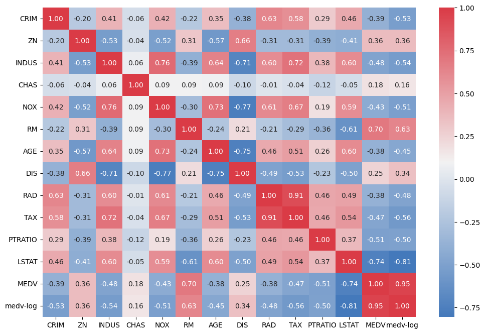
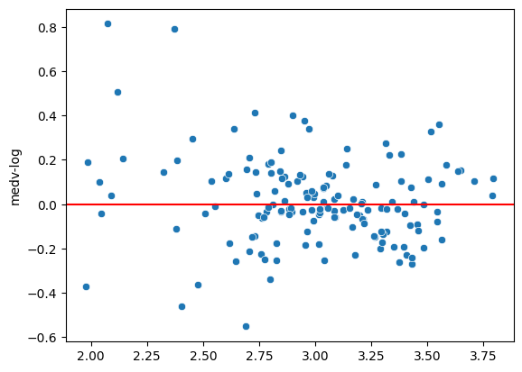
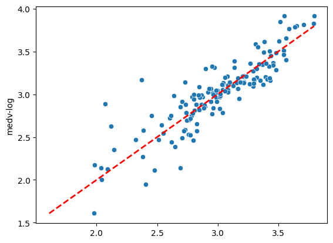

# 🏡 Boston Housing Price Prediction  

This project focuses on predicting housing prices in Boston using Linear Regression.  
It covers exploratory data analysis (EDA), data transformation, correlation studies, and regression modeling with performance evaluation.  

---

## 📊 Dataset
- Source: Boston Housing Dataset (local CSV file: HousingDataboston.csv)  
- Samples: 506  
- Features: 13 independent variables  
- Target: Median value of owner-occupied homes (MEDV)  
- Transformation: A log transformation (medv-log) was applied to the target variable to reduce skewness.  

---

## ⚙️ Technologies & Libraries
- Python 🐍  
- Pandas  
- NumPy  
- Matplotlib & Seaborn (data visualization)  
- Scikit-learn (train/test split, regression, evaluation metrics)  

---

## 🚀 Project Workflow
1. Data Exploration  
   - Display dataset info and statistics (df.info(), df.describe())  
   - Histograms for all variables  
   - Correlation heatmap  
   - Scatterplots for key relationships (e.g., RAD vs TAX, MEDV vs LSTAT, MEDV vs RM)  

2. Feature Engineering & Transformation  
   - Log transformation applied to MEDV → medv-log  

3. Correlation & Cluster Analysis  
   - Investigated relationships between RAD and TAX by splitting data into two clusters  
   - Calculated correlation coefficients for both clusters  

4. Modeling  
   - Defined X (independent variables, excluding MEDV and medv-log)  
   - Defined Y = medv-log  
   - Split data into 70% training and 30% testing  
   - Built Linear Regression model (fit_intercept=True)  

5. Evaluation  
   - R² Score  
   - Mean Absolute Error (MAE)  
   - Root Mean Squared Error (RMSE)  

6. Model Output  
   - Printed regression coefficients for each feature  
   - Printed intercept term  

---

## 📈 Results (example values)
- R² Score: ~0.74  
- MAE: ~0.13  
- RMSE: ~0.18  

*(Note: Exact values may vary depending on dataset splits and preprocessing.)*  

---

## 🖼️ Visualizations
Key visualizations generated in the notebook:  

- ## Correlation Heatmap

  

- ## Residual Plot

  

- ## Prediction vs Actual

---

▶️ How to Run

# Clone the repository
git clone https://github.com/Erfanuu4/House-pricing
cd boston-housing

# Install dependencies 
pip install -r requirements.txt

# Run the notebook
jupyter notebook LREG_B-H.ipynb

---

📌 Future Improvements

Try regularization methods: Ridge, Lasso

Test advanced models: Random Forest, Gradient Boosting, XGBoost

Hyperparameter tuning for improved accuracy

Build an API or web app for real-time predictions

---

✨ Author

👤 [Erfanuu4](https://github.com/Erfanuu4)
